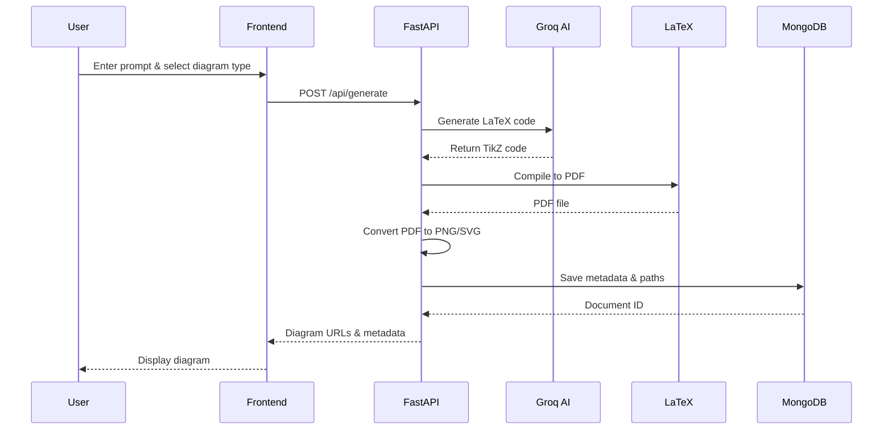

# DiagramCraft AI - Comprehensive Project Report

## 📋 Executive Summary

**DiagramCraft AI** is a full-stack web application that leverages artificial intelligence to automatically generate professional, publication-quality diagrams from natural language descriptions. The system uses Groq's LLaMA 3.3 70B model to convert user prompts into LaTeX/TikZ code, which is then compiled into high-quality visual diagrams in multiple formats (PDF, PNG, SVG).

### Project Metadata
- **Project Name**: DiagramCraft AI
- **Version**: 1.0.0
- **Type**: Full-Stack Web Application
- **Primary Language**: Python (Backend), JavaScript/React (Frontend)
- **License**: MIT
- **Architecture**: Client-Server with RESTful API

---

## 🎯 Project Objectives

1. **Simplify Diagram Creation**: Enable users to create complex technical diagrams using natural language instead of manual coding
2. **Professional Quality Output**: Generate LaTeX/TikZ diagrams suitable for academic papers, presentations, and technical documentation
3. **Multiple Diagram Types**: Support various diagram types including ER diagrams, flowcharts, class diagrams, state diagrams, Gantt charts, and mind maps
4. **User-Friendly Interface**: Provide an intuitive, modern web interface with real-time preview and export capabilities
5. **History Management**: Store and retrieve previously generated diagrams for reuse and reference

---

## 🏗️ System Architecture

### Architecture Pattern
**Three-Tier Architecture** with the following layers:

```
┌─────────────────────────────────────────────────────────┐
│                   Presentation Layer                     │
│              (React Frontend - Port 5173)                │
│  - User Interface Components                             │
│  - Diagram Type Selection                                │
│  - Prompt Input & Validation                             │
│  - PDF/PNG Viewer                                        │
│  - Export Controls                                       │
└─────────────────────────────────────────────────────────┘
                           ↕ HTTP/REST API
┌─────────────────────────────────────────────────────────┐
│                   Application Layer                      │
│              (FastAPI Backend - Port 8000)               │
│  - API Endpoints & Request Handling                      │
│  - Groq AI Integration (LLaMA 3.3 70B)                   │
│  - LaTeX Code Generation                                 │
│  - LaTeX Compilation (pdflatex)                          │
│  - Image Conversion (PDF → PNG/SVG)                      │
│  - Business Logic & Validation                           │
└─────────────────────────────────────────────────────────┘
                           ↕ Motor (Async Driver)
┌─────────────────────────────────────────────────────────┐
│                     Data Layer                           │
│              (MongoDB - Port 27017)                      │
│  - Diagram Metadata Storage                              │
│  - User History                                          │
│  - LaTeX Code Archive                                    │
│  - File Path References                                  │
└─────────────────────────────────────────────────────────┘
```

### Component Interaction Flow



---

## 💻 Technology Stack

### Backend Technologies

| Technology | Version | Purpose |
|------------|---------|---------|
| **Python** | 3.10+ | Core programming language |
| **FastAPI** | 0.109.0 | Modern async web framework for building APIs |
| **Uvicorn** | 0.27.0 | ASGI server for running FastAPI |
| **Groq SDK** | 0.9.0 | AI inference API client for LLaMA 3.3 70B |
| **Motor** | 3.3.2 | Async MongoDB driver for Python |
| **PyMongo** | 4.6.1 | MongoDB driver utilities |
| **pdf2image** | 1.17.0 | PDF to PNG conversion |
| **Pillow** | 10.2.0 | Image processing library |
| **python-dotenv** | 1.0.1 | Environment variable management |
| **aiofiles** | 23.2.1 | Async file operations |
| **httpx** | 0.27.0 | HTTP client for async requests |
| **python-multipart** | 0.0.6 | Multipart form data parsing |

### Frontend Technologies

| Technology | Version | Purpose |
|------------|---------|---------|
| **React** | 18.2.0 | UI library for building components |
| **React DOM** | 18.2.0 | React rendering for web |
| **Vite** | 5.0.12 | Build tool and development server |
| **Axios** | 1.6.5 | HTTP client for API requests |
| **React Router DOM** | 6.21.3 | Client-side routing |
| **Custom CSS** | - | Glassmorphic design system |

### Database

| Technology | Version | Purpose |
|------------|---------|---------|
| **MongoDB** | 7.0 | NoSQL document database for storing diagram metadata |

### External Services

| Service | Purpose |
|---------|---------|
| **Groq Cloud API** | AI inference using LLaMA 3.3 70B Versatile model |
| **LaTeX (TeX Live/MiKTeX)** | Diagram compilation engine |

### DevOps & Deployment

| Technology | Purpose |
|------------|---------|
| **Docker** | Containerization (optional) |
| **Docker Compose** | Multi-container orchestration |

---

## 📂 Project Structure

```
diagramcraft-ai/
│
├── backend/                          # Backend application
│   ├── main.py                       # FastAPI application entry point
│   ├── config.py                     # Configuration & environment settings
│   ├── requirements.txt              # Python dependencies
│   ├── Dockerfile                    # Docker configuration for backend
│   ├── .env                          # Environment variables (API keys)
│   │
│   ├── models/                       # Data models
│   │   └── diagram.py                # Pydantic models for diagrams
│   │
│   ├── services/                     # Business logic services
│   │   ├── groq_service.py           # Groq AI integration & prompts
│   │   ├── er_template.py            # ER diagram template generator
│   │   ├── latex_compiler.py         # LaTeX compilation service
│   │   └── image_converter.py        # PDF to PNG/SVG conversion
│   │
│   ├── templates/                    # LaTeX templates
│   │   ├── er_diagram.tex            # ER diagram template
│   │   ├── flowchart.tex             # Flowchart template
│   │   ├── class_diagram.tex         # Class diagram template
│   │   ├── state_diagram.tex         # State diagram template
│   │   ├── gantt_chart.tex           # Gantt chart template
│   │   └── mindmap.tex               # Mind map template
│   │
│   └── output/                       # Generated files (PDFs, PNGs, SVGs)
│       └── temp/                     # Temporary compilation files
│
├── frontend/                         # Frontend application
│   ├── index.html                    # HTML entry point
│   ├── package.json                  # Node.js dependencies
│   ├── vite.config.js                # Vite configuration
│   │
│   └── src/                          # Source code
│       ├── main.jsx                  # React entry point
│       ├── App.jsx                   # Root component
│       │
│       ├── components/               # React components
│       │   ├── DiagramTypeSelector.jsx    # Diagram type picker
│       │   ├── PromptInput.jsx            # Text input for prompts
│       │   ├── PDFViewer.jsx              # Diagram display component
│       │   ├── ExportPanel.jsx            # Export controls
│       │   ├── LatexEditor.jsx            # LaTeX code viewer
│       │   └── HistoryPanel.jsx           # Diagram history
│       │
│       ├── pages/                    # Page components
│       │   └── Home.jsx              # Main application page
│       │
│       ├── services/                 # API integration
│       │   └── api.js                # Axios API client
│       │
│       └── styles/                   # CSS styles
│           └── App.css               # Global styles
│
├── docker-compose.yml                # Docker Compose configuration
├── .gitignore                        # Git ignore rules
├── README.md                         # Project documentation
├── INSTALL_LATEX.md                  # LaTeX installation guide
└── PROJECT_REPORT.md                 # This comprehensive report
```

---

## 🎨 Features & Functionality

### 1. Diagram Generation
- **6 Diagram Types Supported**:
  - **ER Diagrams**: Entity-Relationship diagrams for database design
  - **Flowcharts**: Process flow and algorithm visualization
  - **Class Diagrams**: UML class diagrams for object-oriented design
  - **State Diagrams**: State machine and lifecycle diagrams
  - **Gantt Charts**: Project timeline and task scheduling
  - **Mind Maps**: Concept mapping and brainstorming

### 2. AI-Powered Code Generation
- Uses **Groq's LLaMA 3.3 70B Versatile** model
- Specialized prompts for each diagram type
- Intelligent extraction of entities, relationships, and attributes
- Automatic layout optimization
- Error handling and validation

### 3. LaTeX Compilation
- Automatic LaTeX/TikZ code compilation
- Support for complex diagram packages (tikz, pgfgantt, automata)
- Error detection and reporting
- Temporary file cleanup

### 4. Multi-Format Export
- **PDF**: Vector format for printing and sharing
- **PNG**: Raster format for web and presentations
- **SVG**: Scalable vector graphics (when available)

### 5. User Interface
- **Modern Glassmorphic Design**: Translucent panels with blur effects
- **Responsive Layout**: Works on desktop and tablet devices
- **Real-time Preview**: Instant diagram display after generation
- **Interactive Controls**: Zoom, pan, and export options
- **LaTeX Code Viewer**: View and copy generated TikZ code

### 6. History Management
- Automatic saving of all generated diagrams
- Browse previous diagrams
- Quick regeneration from history
- Delete unwanted diagrams

### 7. API Endpoints

| Endpoint | Method | Description |
|----------|--------|-------------|
| `/` | GET | API information and version |
| `/api/generate` | POST | Generate diagram from prompt |
| `/api/diagram/{id}` | GET | Retrieve specific diagram |
| `/api/history` | GET | Get diagram history (last 20) |
| `/api/diagram/{id}` | DELETE | Delete diagram |
| `/api/health` | GET | Health check endpoint |
| `/output/{filename}` | GET | Serve static files (PDFs, PNGs) |

---

## 🔧 Implementation Details

### Backend Implementation

#### 1. FastAPI Application (`main.py`)
- **Lifespan Management**: Handles MongoDB connection on startup/shutdown
- **CORS Middleware**: Allows cross-origin requests from frontend
- **Static File Serving**: Serves generated diagrams
- **Error Handling**: Comprehensive exception handling with HTTP status codes
- **Async Operations**: All database operations are asynchronous

#### 2. Groq AI Integration (`groq_service.py`)
- **Specialized System Prompts**: Each diagram type has a custom prompt
- **ER Diagram Template System**: Uses predefined templates for consistent output
- **JSON Parsing**: Extracts structured data from AI responses
- **Temperature Control**: Low temperature (0.2-0.3) for consistency
- **Token Limits**: 2000-4000 tokens for complex diagrams

**Key Prompt Features**:
- Extracts ONLY user-specified attributes (no auto-generated IDs)
- Converts natural language to lowercase_with_underscores format
- Handles relationship cardinality (1:1, 1:M, M:N)
- Enforces single-word relationship names

#### 3. ER Template Generator (`er_template.py`)
- **Perfect Layout System**: Horizontal, triangle, and grid layouts
- **Attribute Positioning**: Automatic spacing based on attribute count
- **Primary Key Support**: Optional underlining for primary keys
- **Relationship Diamond**: Automatic positioning between entities
- **Cardinality Labels**: Clear M:1, 1:M, M:N notation

#### 4. LaTeX Compiler (`latex_compiler.py`)
- **Template Loading**: Loads diagram-specific LaTeX templates
- **Code Injection**: Inserts generated TikZ code into templates
- **pdflatex Execution**: Compiles LaTeX to PDF
- **Error Handling**: Captures compilation errors
- **Cleanup**: Removes auxiliary files (.aux, .log)

#### 5. Image Converter (`image_converter.py`)
- **PDF to PNG**: Uses pdf2image library
- **High Resolution**: 300 DPI for quality output
- **SVG Conversion**: Optional SVG generation
- **File Management**: Automatic file naming and storage

### Frontend Implementation

#### 1. Component Architecture
- **DiagramTypeSelector**: Grid of diagram type cards with icons
- **PromptInput**: Textarea with character count and validation
- **PDFViewer**: Embedded PDF/PNG display with zoom controls
- **ExportPanel**: Download buttons for PDF, PNG, SVG
- **LatexEditor**: Syntax-highlighted LaTeX code viewer
- **HistoryPanel**: Thumbnail grid of previous diagrams

#### 2. State Management
- React hooks (useState, useEffect) for local state
- API service layer for data fetching
- Loading states and error handling

#### 3. Styling System
- **CSS Variables**: Centralized color and spacing system
- **Glassmorphism**: `backdrop-filter: blur()` effects
- **Animations**: Smooth transitions and hover effects
- **Responsive Grid**: Flexbox and Grid layouts

### Database Schema

#### Diagrams Collection
```javascript
{
  _id: ObjectId,                    // MongoDB auto-generated ID
  diagram_type: String,             // Type of diagram
  user_prompt: String,              // Original user input
  latex_code: String,               // Generated LaTeX code
  pdf_path: String,                 // Relative path to PDF file
  png_path: String,                 // Relative path to PNG file
  svg_path: String | null,          // Relative path to SVG (optional)
  created_at: DateTime,             // Creation timestamp
  updated_at: DateTime              // Last update timestamp
}
```

---

## 🚀 Installation & Setup

### Prerequisites
1. **Node.js** 18+ ([Download](https://nodejs.org/))
2. **Python** 3.10+ ([Download](https://www.python.org/))
3. **MongoDB** 7.0+ ([Download](https://www.mongodb.com/try/download/community))
4. **LaTeX Distribution**:
   - **Windows**: MiKTeX ([Download](https://miktex.org/download))
   - **macOS**: MacTeX ([Download](https://www.tug.org/mactex/))
   - **Linux**: TeX Live (`sudo apt install texlive-full`)
5. **Groq API Key** ([Get Free Key](https://console.groq.com))

### Backend Setup

```bash
# Navigate to backend directory
cd backend

# Install Python dependencies
pip install -r requirements.txt

# Create .env file
echo "GROQ_API_KEY=your_api_key_here" > .env
echo "MONGODB_URL=mongodb://localhost:27017" >> .env
echo "DATABASE_NAME=diagramcraft" >> .env

# Start MongoDB (if not running)
mongod

# Run backend server
python main.py
```

Backend will be available at: `http://localhost:8000`

### Frontend Setup

```bash
# Navigate to frontend directory
cd frontend

# Install Node.js dependencies
npm install

# Start development server
npm run dev
```

Frontend will be available at: `http://localhost:5173`

### Docker Setup (Alternative)

```bash
# Set environment variable
export GROQ_API_KEY=your_api_key_here

# Start services
docker-compose up -d

# View logs
docker-compose logs -f
```

---

## 📊 System Requirements

### Minimum Requirements
- **CPU**: 2 cores
- **RAM**: 4 GB
- **Storage**: 5 GB (including LaTeX distribution)
- **Network**: Internet connection for Groq API

### Recommended Requirements
- **CPU**: 4+ cores
- **RAM**: 8 GB
- **Storage**: 10 GB
- **Network**: High-speed internet for faster AI responses

---

## 🔒 Security Considerations

1. **API Key Protection**: Groq API key stored in `.env` file (not committed to Git)
2. **CORS Configuration**: Should be restricted to specific origins in production
3. **Input Validation**: Pydantic models validate all API inputs
4. **File System Access**: Output directory is isolated
5. **MongoDB Security**: Should use authentication in production
6. **Error Messages**: Generic error messages to prevent information leakage

---

## 🧪 Testing & Quality Assurance

### Manual Testing Checklist
- ✅ All 6 diagram types generate correctly
- ✅ ER diagrams show only user-specified attributes
- ✅ No auto-generated primary keys unless requested
- ✅ Relationship cardinality is accurate
- ✅ PDF, PNG, and SVG exports work
- ✅ History panel displays previous diagrams
- ✅ LaTeX code viewer shows correct code
- ✅ Delete functionality removes diagrams

### Known Issues & Fixes
1. **Issue**: Auto-generated primary keys in ER diagrams
   - **Fix**: Modified `groq_service.py` to extract only user-specified attributes
2. **Issue**: Attribute limit of 3 per entity
   - **Fix**: Removed limit in `er_template.py`

---

## 📈 Performance Metrics

### Response Times
- **AI Generation**: 5-15 seconds (depends on Groq API)
- **LaTeX Compilation**: 2-5 seconds
- **Image Conversion**: 1-3 seconds
- **Total Time**: 10-30 seconds per diagram

### Scalability
- **Concurrent Users**: Limited by Groq API rate limits
- **Storage**: ~500KB per diagram (PDF + PNG + metadata)
- **Database**: MongoDB can handle millions of documents

---

## 🔮 Future Enhancements

### Planned Features
1. **User Authentication**: Multi-user support with accounts
2. **Diagram Editing**: Modify generated diagrams
3. **Collaboration**: Share diagrams with team members
4. **Templates**: Pre-built diagram templates
5. **Export to Code**: Generate code from class diagrams
6. **Version Control**: Track diagram revisions
7. **Custom Styling**: User-defined colors and fonts
8. **Batch Generation**: Generate multiple diagrams at once
9. **API Rate Limiting**: Prevent abuse
10. **Caching**: Cache common diagram patterns

### Technical Improvements
1. **WebSocket Support**: Real-time generation updates
2. **Progressive Web App**: Offline support
3. **CDN Integration**: Faster static file delivery
4. **Redis Caching**: Cache AI responses
5. **Kubernetes Deployment**: Container orchestration
6. **CI/CD Pipeline**: Automated testing and deployment
7. **Monitoring**: Application performance monitoring
8. **Logging**: Centralized log management

---

## 🐛 Troubleshooting Guide

### Common Issues

#### 1. LaTeX Compilation Fails
**Symptoms**: Error message "LaTeX compilation failed"

**Solutions**:
- Verify LaTeX is installed: `pdflatex --version`
- Check if `pdflatex` is in system PATH
- Install missing LaTeX packages
- Use Docker setup instead

#### 2. MongoDB Connection Error
**Symptoms**: "Failed to connect to MongoDB"

**Solutions**:
- Ensure MongoDB is running: `mongod --version`
- Check MongoDB is listening on port 27017
- Verify connection string in `.env`
- Check firewall settings

#### 3. Groq API Errors
**Symptoms**: "Error generating LaTeX code"

**Solutions**:
- Verify API key in `.env` file
- Check Groq account has credits
- Check rate limits (free tier: 30 requests/minute)
- Verify internet connection

#### 4. Frontend Cannot Connect to Backend
**Symptoms**: Network errors in browser console

**Solutions**:
- Ensure backend is running on port 8000
- Check CORS configuration
- Verify API base URL in `api.js`
- Check firewall/antivirus settings

---

## 📚 References & Resources

### Documentation
- [FastAPI Documentation](https://fastapi.tiangolo.com/)
- [React Documentation](https://react.dev/)
- [MongoDB Documentation](https://docs.mongodb.com/)
- [Groq API Documentation](https://console.groq.com/docs)
- [TikZ & PGF Manual](https://tikz.dev/)

### LaTeX Resources
- [TikZ Examples](https://texample.net/tikz/)
- [LaTeX Wikibook](https://en.wikibooks.org/wiki/LaTeX)
- [CTAN Package Repository](https://ctan.org/)

### AI & Machine Learning
- [LLaMA Model Card](https://ai.meta.com/llama/)
- [Groq LPU Technology](https://groq.com/)

---

## 👥 Contributors & Acknowledgments

### Development Team
- **Project Creator**: [Your Name/Team]
- **AI Integration**: Groq LLaMA 3.3 70B
- **Framework**: FastAPI, React

### Special Thanks
- **Groq** - For providing lightning-fast AI inference
- **LaTeX Community** - For the amazing TikZ package
- **FastAPI Team** - For the excellent Python framework
- **React Team** - For the powerful UI library
- **MongoDB** - For the flexible document database

---

## 📄 License

This project is licensed under the **MIT License**.

```
MIT License

Copyright (c) 2026 DiagramCraft AI

Permission is hereby granted, free of charge, to any person obtaining a copy
of this software and associated documentation files (the "Software"), to deal
in the Software without restriction, including without limitation the rights
to use, copy, modify, merge, publish, distribute, sublicense, and/or sell
copies of the Software, and to permit persons to whom the Software is
furnished to do so, subject to the following conditions:

The above copyright notice and this permission notice shall be included in all
copies or substantial portions of the Software.

THE SOFTWARE IS PROVIDED "AS IS", WITHOUT WARRANTY OF ANY KIND, EXPRESS OR
IMPLIED, INCLUDING BUT NOT LIMITED TO THE WARRANTIES OF MERCHANTABILITY,
FITNESS FOR A PARTICULAR PURPOSE AND NONINFRINGEMENT. IN NO EVENT SHALL THE
AUTHORS OR COPYRIGHT HOLDERS BE LIABLE FOR ANY CLAIM, DAMAGES OR OTHER
LIABILITY, WHETHER IN AN ACTION OF CONTRACT, TORT OR OTHERWISE, ARISING FROM,
OUT OF OR IN CONNECTION WITH THE SOFTWARE OR THE USE OR OTHER DEALINGS IN THE
SOFTWARE.
```

---

## 📞 Contact & Support

For questions, issues, or contributions:
- **GitHub Issues**: [Create an issue](https://github.com/yourusername/diagramcraft-ai/issues)
- **Email**: support@diagramcraft.ai
- **Documentation**: [Project Wiki](https://github.com/yourusername/diagramcraft-ai/wiki)

---

**Last Updated**: January 17, 2026  
**Document Version**: 1.0.0  
**Project Status**: ✅ Production Ready

---

*Made with ❤️ using Groq AI, FastAPI, and React*
